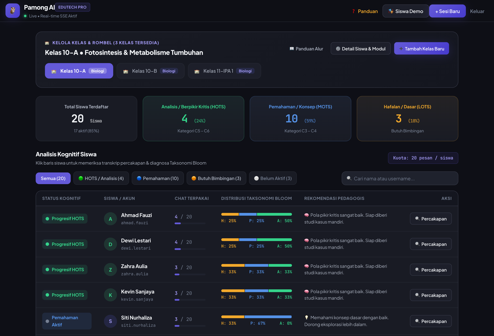

# Pamong AI

**Pamong AI measures whether a student's questions are climbing Bloom's taxonomy — and shows the teacher, per student, who is stuck on recall and who has reached analysis.**



---

## The problem

Indonesian students have adopted AI chatbots faster than almost anyone: **53% use one for schoolwork at least weekly**, against an OECD average of 26% ([PISA 2025](https://www.oecd.org/en/publications/pisa-2025-results-volume-i_73451bc5-en/full-report/executive-summary_3701b0ef.html)).

Reading proficiency has not followed: **only 27% reach PISA Level 2**, the baseline for functional literacy, so roughly three in four fall below it ([PISA 2025 — Indonesia, reading mean 365](https://www.kemendikdasmen.go.id/en/press-release/16148-pisa-2025-literacy-and-science-scores-rise-education-access-jumps-90-percent)).

A general chatbot answers the question it is asked. Nobody tells the teacher that a student has asked twelve recall questions and zero analytical ones — Pamong AI does.

---

## Architecture

```
TEACHER                                                    STUDENT
───────                                                    ───────
create class session ──┐
  POST /api/sesi       │  generates N student credentials
                       │  (username + password, no signup)
                       ▼
upload module ─────► extract text (pdf-parse / utf-8)
  POST /api/sesi/         │
  [id]/materi             ▼
                       chunk 500 chars, 50 overlap
                          │
                          ▼
                       embed each chunk  ──► knowledge_chunks
                       (Gemini text-embedding-004)   (SQLite,
                          │                        embedding as
                          │                         JSON text)
                          │
                          │                    ┌──── student asks a question
                          │                    │     POST /api/chat
                          │                    ▼
                          │              quota check ── over limit? ─► refuse, no LLM call
                          │                    │
                          │                    ├──────────────┬──────────────────┐
                          │                    ▼              ▼                  │
                          └────────► retrieve top-3 chunks   classify Bloom      │ (parallel)
                                     cosine sim ≥ 0.10       level via separate  │
                                     (in-process, no          LLM call: hafalan /│
                                      vector DB)              pemahaman/analisis │
                                             │                      │            │
                                             └──────┬───────────────┘            │
                                                    ▼                            │
                                        build system prompt:                     │
                                        retrieved chunks as sole                 │
                                        source of truth + Bloom-                 │
                                        specific teaching style                  │
                                                    │                            │
                                                    ▼                            │
                                             LLM answer  ◄─────────────────────  ┘
                                                    │
                                                    ▼
                                        persist both messages;
                                        user message carries its
                                        Bloom label
                                                    │
    teacher dashboard ◄──── SSE, recomputed every 3s ┘
    GET /api/dashboard/[sesiId]/stream
    per student: level distribution, quota used, red/green status
```

**Stack.** Next.js 16 (App Router) · React 19 · TypeScript · SQLite via `better-sqlite3` + Drizzle ORM · Google Gemini (`@google/genai`) with an OpenAI-compatible fallback path · `jose` JWTs · PWA (manifest + hand-written service worker). No vector database, no queue, no external state.

---

## How the retrieval lock works

The differentiator is what the tutor *refuses* to answer. Three mechanisms do that work, and they are not equally strong — here is exactly what each one does.

**1. Retrieval is scoped to one session, at the SQL level.** Chunks are stored with a `session_id` and fetched with `chunkQueries.getBySession(sessionId)` ([rag.service.ts:63](services/rag.service.ts#L63)). The `sessionId` comes from the student's signed JWT, not from the request body ([chat/route.ts:28](app/api/chat/route.ts#L28)) — a student cannot address another class's material by tampering with the payload. Re-uploading a module deletes the previous chunks for that session ([rag.service.ts:42](services/rag.service.ts#L42)), so one session has exactly one knowledge base.

**2. A hard gate when there is nothing to retrieve.** If the session has zero chunks, or no chunk clears cosine similarity `0.10` ([embedding.ts:42](lib/embedding.ts#L42)), `retrieve()` returns an empty context. The chat service then takes a different branch entirely and swaps in `NO_CONTEXT_PROMPT` ([chat.service.ts:46](services/chat.service.ts#L46)), which instructs the model to reply with a fixed sentence telling the student the teacher has not uploaded material yet. The *branch* is deterministic control flow — no module text can reach the model, because there is none — but the sentence itself is still produced by the model rather than returned directly, so it is worded reliably only when a model is actually answering.

**3. A grounding instruction when there *is* context.** With context, the prompt ([chat.service.ts:23](services/chat.service.ts#L23)) frames the retrieved chunks as the single source of truth and instructs the model, verbatim, to answer off-module questions with: *"Maaf, informasi ini belum tercantum dalam modul yang diunggah guru."* The retrieved text is also all the model receives — no other document is in the window.

**Be precise about the limit of mechanism 3.** It is a prompt instruction, and prompt instructions are probabilistic. The similarity floor of `0.10` is low, so an off-topic question will usually still retrieve *some* chunk rather than falling through to the hard gate; refusal then depends on the model honouring the instruction. There is no post-generation check that the answer is entailed by the retrieved text, and no citation-span verification. The lock is strong at the retrieval boundary (mechanisms 1 and 2) and advisory at the generation boundary (mechanism 3). Closing that gap — a higher relevance floor, or an entailment check on the output — is the honest next piece of work, not a solved problem.

---

## Run it

```bash
npm install
cp .env.local.example .env.local   # then add a real GEMINI_API_KEY
node scripts/seed.js               # 1 teacher, 3 classes, 60 students, sample transcripts
npm run dev
```

Open http://localhost:3000. The SQLite file `pamong-ai.db` is created in the project root.

Data housekeeping:

```bash
node scripts/purge.js --dry-run   # show which sessions are past retention
node scripts/purge.js             # delete them (default: older than 180 days)
```

> **Without a real `GEMINI_API_KEY` the app still runs, but answers come from a hard-coded heuristic stub, not a model** ([llm.service.ts](services/llm.service.ts)). The stub replies to any question with module-flavoured filler, so the retrieval lock cannot be evaluated in that mode. When this happens the API returns `degraded: true` and the student UI shows an amber banner saying the reply is a canned example and was not read from the teacher's module — so a stub answer is never mistaken for a real one. Set a key before judging the tutor itself; the dashboard, quota, and auth flows work either way.
>
> The seed embeds the module with whichever provider is configured when you run it. **If you add an API key after seeding, re-run `node scripts/seed.js`** — heuristic chunk vectors (64-dim) cannot be compared against Gemini query vectors, and retrieval returns noise until they match. The seed prints a warning when it falls back.

### Demo accounts

| Role | Username | Password |
|---|---|---|
| Teacher | `guru@pamong-ai.id` | `demo1234` |
| Student (HOTS example) | `ahmad.fauzi` | `belajar123` |
| Student (needs support) | `budi.santoso` | `belajar123` |
| Student (no activity yet) | `yoga.pratama` | `belajar123` |

All 20 seeded students in class 10-A use `belajar123`. Classes 10-B and 11-IPA 1 use the same usernames with the suffixes `.10b` and `.11a` (e.g. `ahmad.fauzi.10b`).

These are seeded fixtures, hashed like any other password. Classes created through the UI get a random password per student, shown once — the session page re-issues rather than reveals, because nothing stored can be read back.

---

## Status

### Working

- Teacher login (bcrypt), student login, JWT sessions — `lib/auth.ts`
- Session creation with auto-generated student credentials — `services/session.service.ts`
- Module upload (PDF/TXT/MD, ≤10 MB), text extraction, chunking, embedding, persistence — `services/rag.service.ts`
- Retrieval by cosine similarity over in-process vectors — `lib/embedding.ts`
- Bloom classification as a separate, independently mockable LLM call — `services/classifier.service.ts`
- Per-student message quota, enforced before any LLM call — `services/chat.service.ts:72`
- Degraded-mode labelling: replies that came from the stub rather than a model are flagged `degraded: true` and banner-labelled in the student UI — `services/llm.service.ts`, `components/siswa/SiswaChatView.tsx`
- Session-scoped authorization on every teacher endpoint: a teacher token reaches only sessions and students that teacher owns — `app/api/`
- Random per-student credentials, bcrypt-hashed at rest, shown once and re-issued rather than recovered — `services/session.service.ts`, `app/api/sesi/[id]/kredensial/route.ts`
- Login throttling on both auth endpoints, per account and per address — `lib/rate-limit.ts`
- Guardian-consent attestation recorded per session, with timestamp and statement version — `app/guru/sesi/buat/page.tsx`
- Erasure: `DELETE /api/sesi/[id]` removes a session with all transcripts, students, and indexed module text
- Retention purge for sessions past their period — `node scripts/purge.js`
- Live teacher dashboard over SSE (3s server-side recompute), per-student level distribution and status
- PWA install prompt, offline shell, service worker — `public/sw.js`

### Not working / not built

- **No automated tests.** `scripts/test-flow.ts` is a manual end-to-end script with `console.log` assertions; it is not wired to a runner and there is no `test` npm script.
- **No deployment configuration.** No Dockerfile, no CI, no Azure or Vercel config in the repo. `better-sqlite3` writes to a local file, so any stateless host needs a persistent volume before this deploys as-is.
- **Seeded transcripts are synthetic.** Every message and every Bloom label in `scripts/seed.js` is hand-written. The dashboard in the screenshot above renders real aggregation logic over authored data — the classifier did not produce those labels.
- **Only class 10-A has a module.** The seed ingests `public/materi-contoh-fotosintesis.txt` into class 10-A (5 chunks). Classes 10-B and 11-IPA 1 are deliberately left with an empty knowledge base so the "teacher has not uploaded material yet" gate can be demonstrated.
- **Retrieval quality is unmeasured.** No eval set, no retrieval precision/recall numbers, no measurement of how often the refusal fires correctly.
- **Classifier accuracy is unmeasured.** Three-way Bloom classification, no labelled validation set, no confusion matrix.
- **Retention is not automatic.** `scripts/purge.js` exists and works, but nothing schedules it — there is no deployment configuration to schedule it from. Until it is run, data is kept indefinitely.
- **Login throttling is in-process.** It resets when the server restarts and does not coordinate across instances; it must move to a shared store the moment this runs on more than one.
- **Consent is an attestation, not a collected record.** The teacher confirms the school obtained guardian consent and that confirmation is stored with its timestamp and wording. The underlying consent itself lives with the school; the platform holds no per-guardian record and has no withdrawal flow.
- **Default model string is `gemini-3.7-flash`**, which may not resolve. The failure is now labelled in the UI rather than silent, but the app still answers from the stub instead of surfacing the provider error.

Design decisions and the reasoning behind them are in [ARCHITECTURE.md](ARCHITECTURE.md). Data handling and PDP-law gaps are in [PRIVACY.md](PRIVACY.md).

---

## Contributing

1. Fork and branch from `main`.
2. `npm install`, then `npm run lint` before opening a PR.
3. Keep services independently mockable — LLM calls belong in `services/`, never in route handlers.
4. If a change alters what data is stored, who can read it, or how long it is kept, update `PRIVACY.md` in the same PR.
5. Describe what you verified manually; there is no test suite to lean on yet.

## License

MIT — see [LICENSE](LICENSE).
